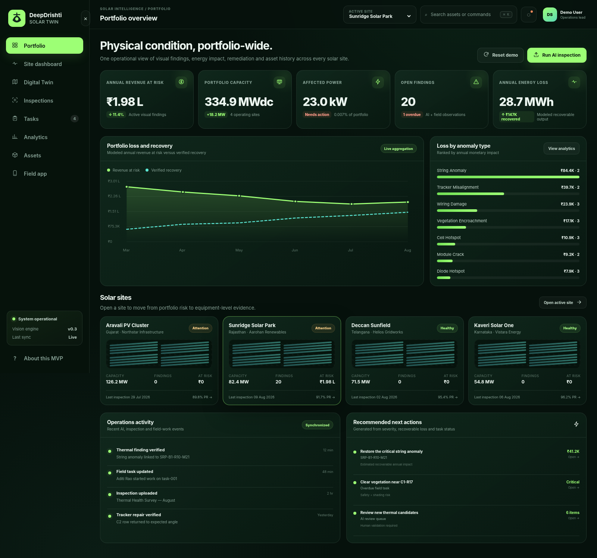
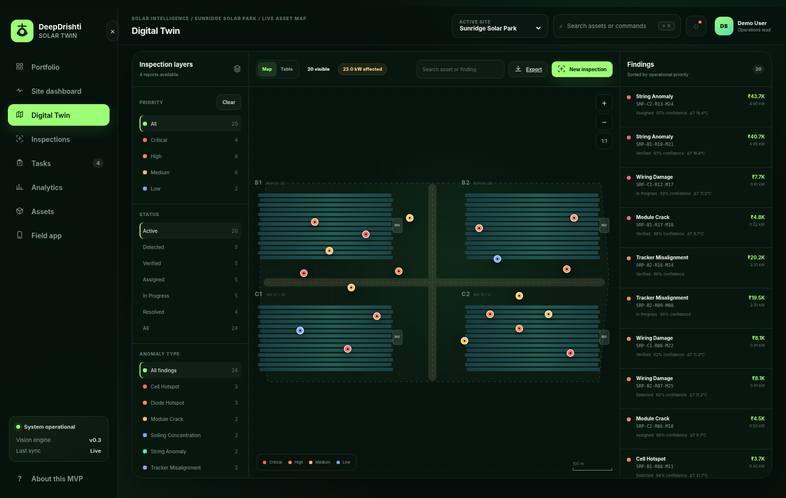
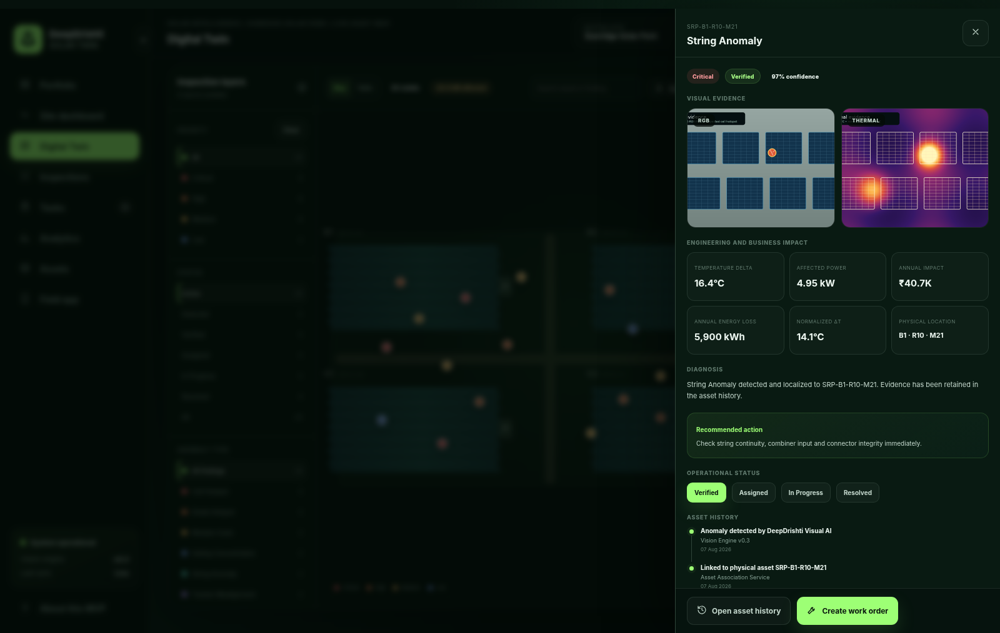
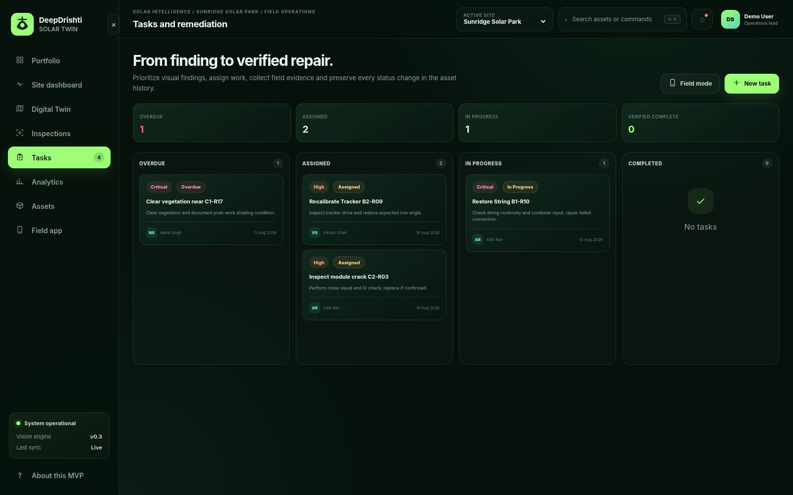

# DeepDrishti Solar Twin MVP

A runnable, independent solar-farm **Visual AI + Digital Twin + O&M workflow** prototype.

It demonstrates the complete commercial story:

> Portfolio risk → site performance → equipment-level Digital Twin → visual/thermal finding → energy and revenue impact → work order → field update → verified resolution → permanent asset history.

This is original DeepDrishti code and synthetic imagery. It uses the broad product pattern seen in modern solar-inspection platforms, but it does **not** contain or reproduce proprietary Raptor Maps code, assets, data, trained models, or hidden implementation details.

## Screenshots

| Portfolio | Equipment-level Digital Twin |
|---|---|
|  |  |

| Anomaly evidence | Remediation board |
|---|---|
|  |  |

## What is working

### Product workflow

- Portfolio dashboard with capacity, power loss, annual energy loss, revenue at risk and overdue tasks
- Site dashboard with visual findings, inspection history and inverter-relative-yield heatmap
- Equipment-level solar Digital Twin rendered as an interactive SVG map
- Shared map/list/table filter state
- Priority, status, anomaly-type and search filtering
- Asset-linked anomaly records with RGB/thermal evidence
- Temperature Delta, affected power, annual kWh loss and annual revenue impact
- Permanent anomaly and asset history
- Work-order creation and assignment
- Task board and field-status updates
- Linked anomaly resolution when a repair is verified
- Responsive mobile/field-app simulation
- CSV export
- Resettable demo data

### Runnable image-analysis demonstration

The **Analyze imagery** flow calls a real backend endpoint. The included pipeline:

1. Accepts a PNG, JPG, WEBP or TIFF image.
2. Normalizes and downsamples it.
3. Computes a warm-color/brightness score.
4. Thresholds candidate hot regions.
5. Extracts connected components.
6. Produces a temperature-delta proxy and confidence.
7. Maps component centroids to Digital Twin coordinates.
8. Associates each candidate with a block, row, module and permanent asset ID.
9. Calculates estimated kW, kWh and INR impact.
10. Stores the result in SQLite as a reviewable anomaly.

A synthetic thermal inspection image is bundled, so the workflow works immediately without external data.

The included image engine is intentionally lightweight and transparent. It is a **technical demonstration**, not a calibrated or certified thermography model. A customer deployment requires radiometric images, camera calibration, field data, model validation and human review.

## Technology

- **Backend:** FastAPI
- **Database:** SQLite
- **Image analysis:** Pillow + deterministic connected-component pipeline
- **Frontend:** Vanilla JavaScript, HTML and CSS; no frontend build step
- **Digital Twin map:** self-contained SVG; no map token or external service required
- **Tests:** Pytest + FastAPI TestClient
- **Deployment:** local Python or Docker

## Fastest way to run

### macOS / Linux

```bash
unzip DeepDrishti_Solar_Twin_MVP.zip
cd deepdrishti_solar_twin_mvp
./run.sh
```

Open:

```text
http://127.0.0.1:8000
```

### Windows PowerShell

```powershell
Expand-Archive DeepDrishti_Solar_Twin_MVP.zip
cd deepdrishti_solar_twin_mvp
.\run.ps1
```

### Manual Python setup

Python 3.11+ is recommended.

```bash
python3 -m venv .venv
source .venv/bin/activate        # Windows: .venv\Scripts\activate
pip install -r requirements.txt
python -m uvicorn app.main:app --host 0.0.0.0 --port 8000 --reload
```

### Docker

```bash
docker compose up --build
```

Then open `http://127.0.0.1:8000`.

## Run tests

```bash
source .venv/bin/activate
pytest -q
```

The tests cover:

- API health and portfolio aggregation
- Anomaly → task → verified resolution workflow
- Actual sample-image analysis and mapped finding creation
- CSV export
- Frontend delivery

## Recommended demo sequence for your boss

1. Open **Portfolio** and explain annual revenue at risk.
2. Open **Site dashboard** and point to the underperforming inverter.
3. Open **Digital Twin** and filter to critical/high findings.
4. Select the critical string anomaly.
5. Show RGB + thermal evidence, Delta-T and financial impact.
6. Create a work order directly from the anomaly.
7. Open **Tasks**, assign/update the repair and mark it in progress.
8. Open **Field app** to show the technician workflow.
9. Mark a task **Verified** and show that the linked finding becomes resolved.
10. Open **Inspections**, run the bundled sample and watch new AI candidates appear on the map.
11. Open **Assets** and explain how every inspection and action remains attached to the module history.

## Main API routes

| Method | Route | Purpose |
|---|---|---|
| GET | `/api/health` | Health check |
| GET | `/api/portfolio` | Portfolio KPIs and analytics |
| GET | `/api/sites` | Site list |
| GET | `/api/sites/{site_id}` | Site dashboard data |
| GET | `/api/sites/{site_id}/anomalies` | Filterable findings |
| GET | `/api/anomalies/{anomaly_id}` | Full anomaly/evidence/history record |
| PATCH | `/api/anomalies/{anomaly_id}` | Status, priority or notes update |
| GET | `/api/sites/{site_id}/inspections` | Inspection history |
| POST | `/api/inspections/analyze` | Run the demonstration image pipeline |
| GET | `/api/tasks` | Task list |
| POST | `/api/tasks` | Create and link work order |
| PATCH | `/api/tasks/{task_id}` | Update field workflow |
| GET | `/api/sites/{site_id}/assets` | Asset hierarchy summary |
| GET | `/api/sites/{site_id}/export.csv` | Export findings |
| POST | `/api/reset` | Restore seed data |

Interactive API documentation is available at:

```text
http://127.0.0.1:8000/docs
```

## Project structure

```text
deepdrishti_solar_twin_mvp/
├── app/
│   ├── main.py                 # FastAPI routes and workflow logic
│   ├── db.py                   # SQLite schema, seed data and Digital Twin records
│   ├── vision.py               # Runnable thermal-image demonstration pipeline
│   ├── data/                   # Runtime SQLite database
│   └── static/
│       ├── index.html
│       ├── styles.css
│       ├── app.js              # Complete interactive product UI
│       ├── assets/             # Original synthetic evidence images
│       └── uploads/            # Runtime inspection uploads
├── tests/test_app.py
├── docs/
│   ├── ARCHITECTURE.md
│   ├── PRODUCT_BACKLOG.md
│   └── screenshots/
├── CODEX_PROMPT.md
├── requirements.txt
├── run.sh
├── run.ps1
├── Dockerfile
└── docker-compose.yml
```

## What to replace for a customer-ready product

The MVP is intentionally self-contained. A production system should replace or extend the following:

- SVG farm plan → PostGIS geometry, orthomosaics, MapLibre/deck.gl and vector/raster tiles
- SQLite → PostgreSQL/PostGIS
- Demo image analysis → validated thermal/RGB model packages with MLflow/versioning
- Synthetic module hierarchy → customer CAD/as-built import and field reconciliation
- Seed inverter values → SCADA/DAS connector and time-series database
- Local files → S3/MinIO and cloud-optimized GeoTIFFs
- In-process analysis → GPU workers and a job queue
- Responsive mobile view → offline-capable PWA/native application
- Simple task states → RBAC, vendor workflows, attachments, audit events and notifications
- Heuristic impact factors → customer-calibrated production and economic models
- Single-user demo → organizations, roles, portfolio tenancy and SSO

See [docs/ARCHITECTURE.md](docs/ARCHITECTURE.md) and [docs/PRODUCT_BACKLOG.md](docs/PRODUCT_BACKLOG.md) for the recommended evolution path.

## Resetting the application

Use the **Reset demo** button, or run:

```bash
curl -X POST http://127.0.0.1:8000/api/reset
```

## Safety and accuracy note

The demo must not be used for live electrical, fire, warranty or maintenance decisions. Thermal interpretation and energy-impact estimation require validated inputs, domain review and documented accuracy thresholds.
